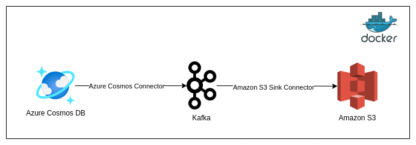

# Azure CosmosDB Backup

This project intends to provide a way to export data from Azure Cosmos DB using Kakfa and Kafka Connect. In order to archieve this goal kafka connect is heavily used with two connectors:

- [Azure Cosmos DB Connector](https://www.confluent.io/hub/microsoftcorporation/kafka-connect-cosmos)
- [Amazon S3 Sink Connector](https://www.confluent.io/hub/confluentinc/kafka-connect-s3)




## Before Beginning
---

in order to run this project you should have deployed the followed resources:

1. [Azure CosmosDB](https://azure.microsoft.com/en-us/products/cosmos-db) - With a database and containers configured having data. From where, data will be extracted

2. [AWS S3](https://aws.amazon.com/s3/) - Amazon Storage solution where data will be saved

3. AWS IAM User - User that will be used by kafka in order to authenticate at AWS and move data to S3 resource. Keep in mind that, this user should have this permissions on S3 bucket

```json
{
    "Version": "2012-10-17",
    "Statement": [
        {
            "Sid": "VisualEditor0",
            "Effect": "Allow",
            "Action": [
                "s3:ListBucket",
                "s3:GetBucketLocation"
            ],
            "Resource": "<bucket-arn>"
        },
        {
            "Sid": "VisualEditor1",
            "Effect": "Allow",
            "Action": [
                "s3:PutObject",
                "s3:GetObject",
                "s3:AbortMultipartUpload",
                "s3:PutObjectTagging"
            ],
            "Resource": "<bucket-arn>/*"
        },
        {
            "Sid": "VisualEditor2",
            "Effect": "Allow",
            "Action": "s3:ListAllMyBuckets",
            "Resource": "arn:aws:s3:::*"
        }
    ]
}
```

4. Install [Docker](https://docs.docker.com/engine/install/ubuntu/) and [Docker-Compose](https://docs.docker.com/compose/install/) - This application relies on Docker to Run


## Running

In order to running this application perform the following steps

1. Start the Application using Docker - As a result a KAFKA-UI will be exposed at **localhost:3030.**
```bash
# On docker-compose.yml directory run this command
docker-compose up -d
```

2. Deploy Kafka Connect CosmosDB Source - For that, you can use the Kafka-UI or the command line, a configuration template could be found [here](./config/source-cosmos.properties).

```bash
curl -i -X POST -H "Accept:application/json" -H "Content-Type:application/json" localhost:8083/connectors/ -d '{
  "name": "dev-wus2-acquiring-dbs-sql-cdb-rule",
  "config": {
    "connector.class": "com.azure.cosmos.kafka.connect.source.CosmosDBSourceConnector",
    "tasks.max": "1",
    "connect.cosmos.connection.endpoint": "https://dev-wus2-acquiring-dbs-sql-cdb.documents.azure.com:443/",
    "connect.cosmos.master.key": "<cosmos-master-key>",
    "connect.cosmos.databasename": "general-db",
    "connect.cosmos.containers.topicmap": "cosmos.anticipation.rule#AnticipationRule",
    "connect.cosmos.offset.useLatest": "false",
    "connect.cosmos.messagekey.enabled": "false",
    "key.converter": "org.apache.kafka.connect.json.JsonConverter",
    "key.converter.schemas.enable": "true",
    "value.converter": "org.apache.kafka.connect.json.JsonConverter",
    "value.converter.schemas.enable": "true"
  }
}'
```

3. Deploy Kafka Connect Aws S3 Sink - For that, you can use the Kafka-UI or the command line, a configuration template could be found [here](./config/sink-s3.properties)

```bash
curl -i -X POST -H "Accept:application/json" -H "Content-Type:application/json" localhost:8083/connectors/ -d '{
  "name": "cosmosdb-backup",
  "config": {
    "connector.class": "io.confluent.connect.s3.S3SinkConnector",
    "topics": "cosmos.anticipation.rule,",
    "tasks.max": "1",
    "key.converter": "org.apache.kafka.connect.json.JsonConverter",
    "key.converter.schemas.enable": "true",
    "value.converter": "org.apache.kafka.connect.json.JsonConverter",
    "value.converter.schemas.enable": "true",
    "format.class": "io.confluent.connect.s3.format.json.JsonFormat",
    "flush.size": "1000",
    "partition.duration.ms": "60000",
    "rotate.interval.ms": "60000",
    "rotate.schedule.interval.ms": "300000",
    "s3.bucket.name": "acqio-azurecosmos-backup",
    "s3.region": "us-east-1",
    "aws.access.key.id": "<AWS-ACCESS-KEY>",
    "aws.secret.access.key": "<AWS-SECRET-KEY>",
    "storage.class": "io.confluent.connect.s3.storage.S3Storage",
    "topics.dir": "test2",
    "timezone": "UTC"
  }
}'
```

4. Wait for 5 minutes for the AWS S3 sink connector commits the file. 

## References
---

- [Azure Cosmos DB Connector](https://github.com/microsoft/kafka-connect-cosmosdb)
- [Amazon S3 Sink Connector](https://docs.confluent.io/kafka-connectors/s3-sink/current/overview.html)